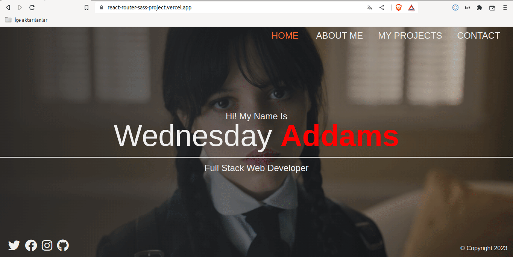

#Sass Portfolio with React Router 

## Description

Project aims to create a Sass Portfolio with Router.

```
006 - Sass Portfolio with React Router (folder)
|
|----readme.md        
SOLUTION
├── public
│     └── index.html
├── src
│   ├── App.js
│   ├── App.scss
│   ├── assets
│   │   └── img
│   ├── components
│   │   ├── Error
│   │   │   ├── NotFound.css
│   │   │   └── NotFound.jsx
│   │   ├── Footer
│   │   │   ├── Footer.jsx
│   │   │   └── Footer.scss
│   │   ├── Navbar
│   │   │   ├── Navbar.jsx
│   │   │   └── Navbar.scss
│   │   └── ProjectCards.jsx
│   ├── helper
│   │   └── imageData.js
│   ├── index.css
│   ├── index.js
│   ├── pages
│   │   ├── about
│   │   │   ├── About.jsx
│   │   │   └── About.scss
│   │   ├── contact
│   │   │   ├── Contact.jsx
│   │   │   └── Contact.scss
│   │   ├── home
│   │   │   ├── Home.jsx
│   │   │   └── Home.scss
│   │   └── projects
│   │       ├── Projects.jsx
│   │       └── Projects.scss
│   ├── router
│   │   └── router.js
│   └── scss
│       ├── _mixins.scss
│       ├── _reset.scss
│       └── _variables.scss
├── package.json
└── yarn.lock
```

## Expected Outcome




### Technologies

- HTML

- CSS

- JS

- ReactJS


